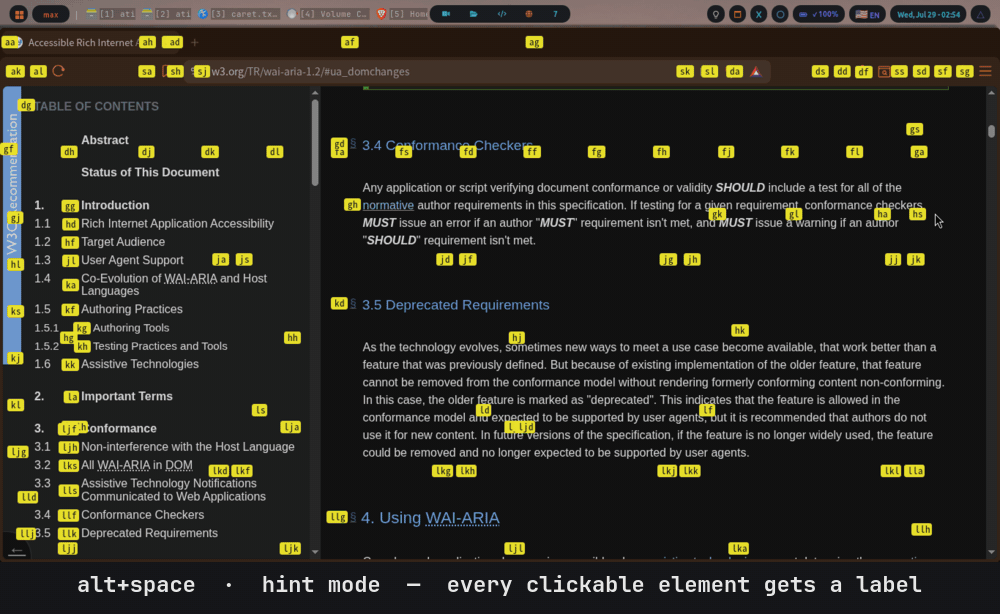

# homerow-replika

Keyboard control of the whole desktop on X11 — click anything, scroll anything,
search anything, put a cursor in text. Modelled on
[Homerow](https://homerow.app) for macOS.



Homerow reads macOS's Accessibility API to find real UI elements. The direct
Linux equivalent is **AT-SPI2**, which is what this uses — so hints land on real
elements with real bounds, not on guessed rectangles or screen-scraped pixels.

Built and used on Arch + qtile + picom, Python 3.14.

## Modes

One key per mode, no chord in the way:

| Key | Mode | Homerow's |
|---|---|---|
| `alt+space` | hint / click | `shift+space` |
| `alt+j` | scroll | `shift+J` |
| `alt+/` | search | `shift+/` |
| `alt+c` | caret | — |
| `alt+shift+c` | caret search | — |

`alt` rather than `shift`, because grabbing `shift+<key>` globally on X11 would
swallow it everywhere you type.

### Hint

Labels every clickable element, and every other visible window.

| Key | Action |
|---|---|
| `a`–`l` | type a label to click it, or switch to that window |
| any other letter | **filter** — narrows the hints and relabels the survivors |
| `Shift`+label | shift-click (new tab) |
| `Ctrl`+label | ctrl-click (background tab) |
| `,` then label | right-click |
| `.` then label | middle-click |
| `Backspace` | undo |
| `Esc` | cancel |

Windows are labelled in a second colour, so the same keypress that clicks a
button can instead switch apps.

### Scroll

Enters immediately on the region under the pointer, else the largest. No picker.

| Key | Action |
|---|---|
| `j` / `k` | line down / up |
| `d` / `u` | half page |
| `gg` / `G` | top / bottom |
| `h` / `l` | sideways — only offered where content overflows sideways |
| `3j`, `5k` | count prefixes |
| `Tab` | next region |
| `Esc` | leave |

### Search

Modelled on vim's `/`.

| Key | Action |
|---|---|
| any letter | filter; matches are outlined and numbered |
| `1`–`9` | click that match |
| `Tab` / `Shift+Tab` | cycle |
| `Enter` | click the current match |
| `Esc` | cancel |

Labels are **digits** so every letter stays usable in the query — that is what
lets filtering and picking share one prompt instead of needing two phases.
Matches are ranked: whole-label hits, then whole-word, then prefix, then
substring.

### Caret

A real text cursor driven by vim motions, over AT-SPI's Text interface.

| Key | Action |
|---|---|
| `h j k l` | move by character / line |
| `w` `b` `e` | by word |
| `0` `$` | line start / end |
| `gg` `G` | document start / end |
| `v` / `V` | visual select / visual line select |
| `y` | yank the selection (or the word under the cursor) |
| `yy` | yank the current line |
| `1`–`9` / `Tab` | jump between text blocks |
| `/` | reopen caret search (see below) without leaving caret mode |
| `Esc` | leave |

Yanking stays in caret mode afterward, same as vim — it doesn't exit, so `yy`
can be followed by more motion or another yank. `/` works the same way: land
on a word via caret search, select or yank something, then `/` again to find
the next thing — no need to back out to Esc and press the hotkey over again.

In apps with their own vim caret mode — qutebrowser, Firefox — it enters
*theirs* instead, and says so.

### Caret search

Type to find a word or link anywhere on the page; matches are labelled as
you type, same as search mode. Picking one doesn't click it — it opens caret
mode with the cursor already sitting on that exact word, so a long article
or a page full of links is reachable by name instead of by Tab-cycling
through whole blocks one at a time.

| Key | Action |
|---|---|
| any letter | filter; matches are outlined and numbered |
| `1`–`9` | jump the caret to that match |
| `Tab` / `Shift+Tab` | cycle |
| `Enter` | jump to the current match |
| `Esc` | cancel |

Bound separately from plain caret mode (`--caret-search`, see Install below)
so the existing "land on the biggest/nearest block immediately" behavior of
`--caret` is unchanged.

## Install

Requires `at-spi2-core`, `python-gobject`, `libX11`/`libXtst`, `picom`,
`openbsd-netcat`. All present on a typical Arch desktop.

```sh
git clone <this repo> ~/homerow-replika
```

Bind the modes (qtile shown; any WM works — they are just commands):

```python
HOMEROW = os.path.expanduser("~/homerow-replika/homerow-hint")
Key([mod2], "space",        lazy.spawn(HOMEROW)),
Key([mod2], "j",            lazy.spawn(HOMEROW + " --scroll")),
Key([mod2], "slash",        lazy.spawn(HOMEROW + " --search")),
Key([mod2], "c",            lazy.spawn(HOMEROW + " --caret")),
Key([mod2, "shift"], "c",   lazy.spawn(HOMEROW + " --caret-search")),
```

Start the daemon at login — a line in your autostart, or the unit in
`contrib/homerow.service`:

```sh
mkdir -p ~/.config/systemd/user
cp contrib/homerow.service ~/.config/systemd/user/
systemctl --user enable --now homerow
```

If it is not running, the client starts it and retries, so nothing breaks when
you forget.

### Chromium and Electron need a flag

They expose nothing to accessibility by default. Add it to
`~/.config/brave-flags.conf`, `~/.config/code-flags.conf`,
`~/.config/obsidian/user-flags.conf` — each app reads its own file — and
restart the app:

```
--force-renderer-accessibility
```

GTK apps need `gsettings set org.gnome.desktop.interface toolkit-accessibility true`.

VS Code additionally switches into "Screen Reader Optimized" mode with the
flag; `"editor.accessibilitySupport": "off"` in its settings keeps hints
without that.

## How it runs

A resident daemon holds the Python interpreter, the PyGObject imports and the
AT-SPI connection. `homerow-hint` is a shell script that writes one line to a
unix socket and exits — deliberately not Python, because the interpreter alone
cost more than all the real work combined.

```
alt+space
  └─ homerow-hint (sh + nc, ~12ms)
       └─ $XDG_RUNTIME_DIR/homerow.sock
            └─ homerow-daemon ── collect ~25ms ── overlay ~2ms
```

```sh
homerow-daemon --status       # is one answering?
homerow-daemon --log          # tail the log
homerow-daemon --quit         # stop it
homerow-daemon -d/--debug     # foreground, mirror the log to stdout
homerow-daemon -h/--help      # usage
homerow-daemon -v/--version   # installed version
```

The daemon always logs to `$XDG_STATE_HOME/homerow/homerow.log`. Restart it
after editing anything under `homerow/` — it holds the modules in memory.

`homerow-hint` itself takes `-h/--help` and `-v/--version` too (it forwards
them to `homerow-cli`, same as `-l/--list` and `-d/--debug`), so `homerow-hint
-v` works whether or not a daemon is running.

## Theming

Colours come from the desktop theme, re-read on every press so a theme switch
lands immediately:

1. `~/.cache/qtile/current_palette.json` (written by `theme-apply`)
2. `~/.cache/wal/colors.json`
3. a built-in fallback

| Role | Slot | Setting |
|---|---|---|
| hint chip | dominant accent | `CHIP_SLOT` |
| typed prefix, scroll outline | cyan | `CHIP_SLOT_MATCHED` |
| window chip | purple | `CHIP_SLOT_WINDOW` |

Text colour is chosen by measuring the chip's luminance, so light themes stay
readable. Nothing is hardcoded: even the fallback is hex names run through the
same slot and contrast logic. `FOLLOW_THEME = False` pins it.

Everything tunable lives in `homerow/config.py` — named settings, no magic
numbers left in the modules.

## Coverage

| App | Result |
|---|---|
| Brave / Chromium | full, with the flag |
| Firefox | full |
| qutebrowser | full chrome and page |
| VS Code, Obsidian | full, with the flag |
| Kate, Dolphin, pcmanfm-qt | full, including file lists |
| pavucontrol | works, via two fallbacks |
| pcmanfm (GTK) | chrome only — its folder view publishes nothing |
| terminals, VLC | nothing to hint; window switching and scrolling still work |

Measured over 15 real sites: 91 hints per page on average at ~200ms, 1.9 scroll
regions, 0.9% of hints without a name.

## Tests

```sh
python3 -m unittest discover -s tests
```

Split by subject: `test_pure.py` covers the algorithms (label generation,
ranking, dedup, overflow detection); `test_rules.py` covers the decisions
(which window counts as focused, what is worth offering, how a match is graded)
plus structural checks that caught real crashes — every `connect()` handler
must exist, every module referenced must be imported.

## Notes from building this

Things that were not obvious, kept because they will bite again:

**Never walk the AT-SPI tree.** Every node access is a D-Bus round trip, about
480 nodes/sec. `Collection.get_matches` runs the filter inside the target app
and answers in one trip. Names and roles are lazy for the same reason.

**Don't shell out on a hot path.** Every `xdotool` call is an ~11ms process
spawn. `homerow/x11.py` binds what is actually needed through ctypes: active
window lookup went 11ms → 0.3ms, window enumeration 114ms → 1ms.

**Scope to the window, then the tab.** An app reports every window it has, and
a WM that stacks them puts several at identical coordinates — Brave had six
frames, three sharing one rectangle. Clipping by geometry alone lets windows
you cannot see contribute hints. Background tabs do the same: Qt WebEngine
keeps them all alive claiming SHOWING and VISIBLE, so a five-tab window offered
five pages of hints stacked on one viewport.

**Override-redirect overlays do not composite** under qtile + picom. A `POPUP`
maps, `draw` fires, and nothing appears. `TOPLEVEL` with the DOCK hint works,
plus an explicit `raise_()` — and picom needs the window excluded from its
animations, or hints slide in from the top instead of appearing on their
targets.

**Grab the keyboard exclusively, and never indefinitely.** `owner_events=False`
or keystrokes leak to the app underneath. And every mode closes itself after a
spell with no input: the grab is exclusive, so a session left open by accident
is indistinguishable from the keyboard breaking.

**Measure scrollability, then verify it.** Role is a bad signal — a short list
is still a `LIST`. Content overflow is better, but a virtualised list renders
only its visible rows, so nothing measurable proves it scrolls. Those are found
by actually scrolling them and watching what moves.

**A rescue budget spent on wrappers never reaches the real scroller.** Live on
devdocs.io: overflow measurement found nothing scrollable at all, yet the
content pane plainly scrolls — confirmed by probing it directly. It ranked
3rd by area behind two non-scrolling page-level wrapper candidates (the whole
toolbar+page area, and the whole document including the sidebar), so a rescue
budget of 2 spent both slots on wrappers and never got to it. Two fixes:
raise the budget, and keep testing after the first success instead of
stopping there — a page can have more than one virtualised pane (a sidebar
*and* its content), and stopping early rescues one and leaves the other
looking permanently unscrollable.

**A wall-clock deadline for the whole pass, not just each call.**
`Atspi.set_timeout()` bounds one D-Bus call; `scroll.collect()` makes many of
them per press. Each easily dodges that per-call cap alone, but they can sum
to a real stall when the accessibility service is merely slow, not hung. A
single overall budget (`SCROLL_COLLECT_BUDGET_MS`) covers that case instead,
learned from reading a comparable project's collector
([museslabs/stochos](https://github.com/museslabs/stochos)), which wraps its
whole async collection in one outer deadline for the same reason.

## Limits

- **AT-SPI is uneven.** macOS AX is one API every app implements; this is
  per-toolkit. Qt WebEngine publishes no text at all, so caret mode hands off
  to the browser's own. pcmanfm publishes no file list, in any view mode.
- **A page's tree lags its rendering.** Press immediately after a page loads
  and you may get nothing.
- **JS-heavy apps expose invisible elements** as showing, with real coordinates
  and names — indistinguishable from real controls.

## Licence

MIT.
